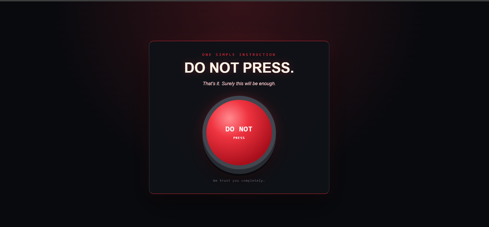
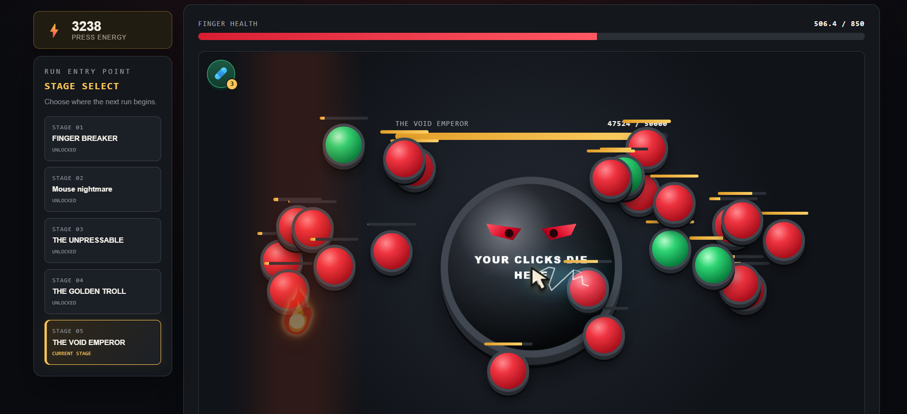
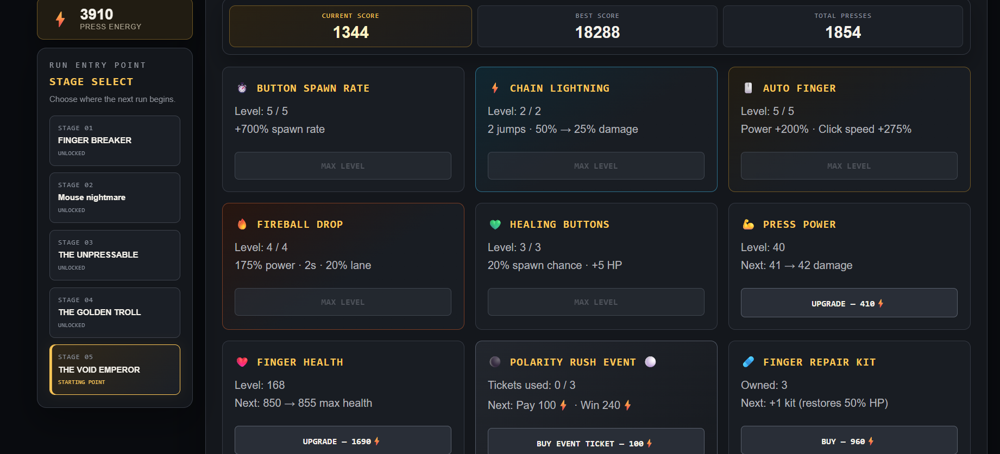
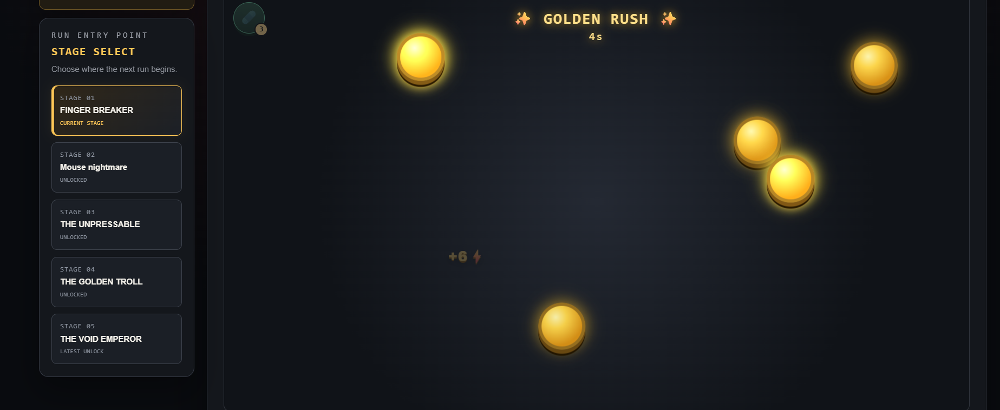
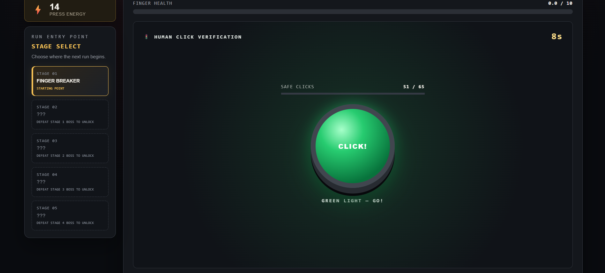
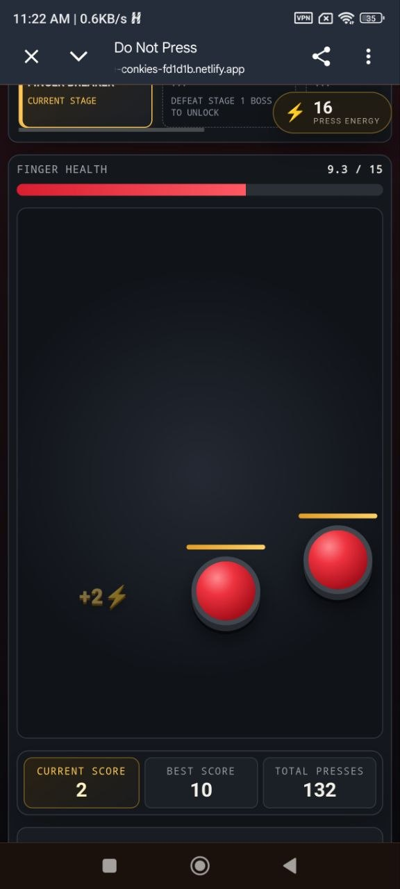

# Do Not Press — Meme Clicker Tycoon

**Do Not Press** is a small clicker/tycoon game based on the classic **“Do Not Press the Red Button”** internet meme. The player ignores one simple warning, is sentenced to the Button Testing Department, and must turn finger pain into **Press Energy**. That energy buys permanent upgrades, consumable tools, and automation powerful enough to defeat five increasingly cursed boss buttons.

This project was created for the CashFactories developer test assignment. It is a complete, playable frontend demo rather than a production service: the main loop, progression, economy, seven upgrade systems, three events, structured persistence, automation, five stages, a demo ending, an endless continuation, and responsive desktop/mobile layouts are implemented.

## Live demo

[Play the current Netlify build](https://deluxe-conkies-fd1d1b.netlify.app/)

## Screenshots

### The forbidden-button intro



### Late-stage gameplay and automation

The final boss stage with regular targets, healing buttons, Auto Finger, Chain Lightning, and Fireball Drop active at the same time.



### Upgrade shop and stage selection



### Events

| Golden Rush | Red Light / Green Light | Polarity Rush |
| --- | --- | --- |
|  |  |  |

### Mobile portrait layout

<p align="center">
  
</p>

The interface also has a dedicated compact layout for phones in landscape orientation.

## Assignment requirements

| Requirement | Implementation |
| --- | --- |
| One meme with a story/setting | The “Do Not Press the Red Button” meme becomes the Button Testing Department, introduced through a first-time temptation/punishment sequence and concluded after the fifth boss. |
| Main resource | **Press Energy** is earned from destroyed targets, bosses, and successful events. |
| Main player action | The player hunts and presses buttons before continuous finger-health drain ends the run. |
| At least five upgrades | Press Power, Finger Health, Button Spawn Rate, Chain Lightning, Healing Buttons, Auto Finger, and Fireball Drop are permanent upgrade systems. Finger Repair Kits are an additional consumable purchase. |
| At least three events | Golden Rush, Red Light / Green Light Verification, and Polarity Rush are fully playable and have different triggers, rules, risks, and rewards. |
| Structured persistence | Progress, purchases, inventory, event history, intro/ending state, scores, and unlocked stages are stored in one versioned and validated `localStorage` document. |
| Upgrades must affect progress | Every purchase changes damage, survival, resource availability, target flow, healing, or automated damage. |
| Two upgrades must change mechanics | Chain Lightning, Healing Buttons, Auto Finger, Fireball Drop, and Button Spawn Rate change how the player interacts with the field rather than only multiplying a number. |
| Development stages | Five boss stages have different durability, damage, presentation, rewards, and stage-scaled small targets. Defeated stages are unlocked as selectable starting points. |
| Progress after reload | The structured save is loaded on startup and rewritten whenever persistent progress changes. |
| Three monetization ideas | Three non-functional, non-pay-to-win concepts are documented in the [Monetization concepts](#monetization-concepts) section. |
| Desktop and mobile | Responsive layouts support desktop, phone portrait, and phone landscape orientations. Pointer Events provide mouse and touch input through the same handlers. |

## Meme, story, and setting

The meme works because a visible prohibition makes the forbidden action more tempting. The game preserves that joke instead of treating “meme” as a visual skin:

1. A first-time visitor sees one large button and one instruction: **DO NOT PRESS**.
2. The game measures how long the visitor resists and mocks the result after the inevitable press.
3. Pressing sends the player to the Button Testing Department, where health continuously drains and escape requires defeating five boss buttons.
4. Boss text, failure messages, event introductions, and stage transitions continue the same self-aware joke.
5. Defeating the Void Emperor opens a first-time demo ending with two choices: leave the chamber or continue clicking in Endless Mode.

The intro and ending are persisted, so they do not interrupt every later session.

## Core loop

1. Select any unlocked stage as the run entry point.
2. Start a run with full finger health.
3. Find randomly positioned small buttons and destroy them for Press Energy.
4. Survive the preparation phase while buttons continue spawning.
5. Fight the stage boss while normal targets remain available for farming and healing opportunities.
6. Spend saved energy between runs on damage, health, spawn speed, healing, automation, or event access.
7. Retry with permanent progress, defeat the boss, unlock the next stage, and face stronger targets.

The player is not expected to defeat every newly reached boss immediately. Choosing between attacking the boss, farming regular buttons, using a Repair Kit, and relying on automation is the central progression decision.

## Run phases and progression

The interface is controlled by explicit gameplay phases in React state:

- `intro`: first-time meme hook and punishment reveal.
- `waiting`: stage selection and the next-run entry point.
- `smallButtons`: preparation phase with continuous target spawning.
- `boss`: the boss enters while small targets continue spawning.
- `stageComplete`: a short transition before the next stage.
- `cooldown`: a three-second recovery penalty after the finger reaches zero health.
- Event phases: separate intro, gameplay, and result phases for Golden Rush, Red Light, and Polarity Rush.
- `demoEnding`: the first victory over the fifth boss, followed by the leave/endless choice.

Five bosses provide visible development stages. Later stages increase normal-target durability more aggressively than their rewards, so progression remains useful without making earlier energy instantly meaningless. The stage selector lets the player revisit any unlocked stage or begin from the latest unlocked one.

After the first final-boss victory, **Endless Mode** is available from the ending screen. It currently repeats the final stage as an optional post-demo challenge.

## Economy

### Resource flow

**Press Energy** is the main currency. Regular targets provide the repeatable income, stage bosses provide milestone rewards, and events provide optional bursts of energy. Current score measures energy earned during one run; best score stores the highest single-run result.

Finger health is the run timer. It drains continuously:

- Preparation damage is 25% of the current boss damage, with a minimum of 1 HP per second.
- Boss phases apply the boss's full damage rate.
- Higher health extends a run, but later stages and bosses make that time increasingly expensive.

### Purchases and their effects

| Purchase | Effect on progression |
| --- | --- |
| **Press Power** | Adds direct manual damage per press. |
| **Finger Health** | Permanently increases maximum health for every run. |
| **Button Spawn Rate** | Adds more targets per unit of time, preventing high-power players from waiting for income. |
| **Chain Lightning** | A press jumps to the nearest target for 50% damage; level two adds another jump for 25% damage. It can originate from a normal target or a boss. |
| **Healing Buttons** | Adds a configurable chance for green buttons to spawn. Destroying one restores health, creating a new target-priority decision. |
| **Auto Finger** | Moves to targets and presses automatically. Its damage and click rate increase across levels. |
| **Fireball Drop** | Periodically targets a vertical lane and damages every regular target and boss inside it. Levels improve power, frequency, and lane width. |
| **Finger Repair Kit** | A stackable consumable that restores 50% of maximum health during a run. Its price grows with the number currently owned and falls again as kits are consumed. |
| **Polarity Rush Ticket** | Pays energy to start a limited event attempt with a clearly displayed possible return. |

All balance data is centralized in `src/data/gameConfig.js`, including boss parameters, target scaling, event timings, upgrade levels, prices, and automation values. This makes later play-testing and server-managed balance possible without rewriting the game loop.

## Events

The three events are intentionally different from normal boss progression.

### Golden Rush — bonus event

The first victory over a new non-final boss unlocks a short Golden Rush. One-hit golden buttons appear and disappear quickly, forcing the player to collect as many as possible before the timer expires. Their reward is based on the completed stage and is shown through animated energy popups.

### Red Light / Green Light Verification — risk and penalty event

This event is triggered before a later run when lifetime manual presses cross configured milestones. The player must reach a safe-click target during green periods. Pressing during red triggers a **CAUGHT** state and locks input for several seconds while the overall event timer continues, turning mistakes into a meaningful time penalty.

### Polarity Rush — purchasable challenge event

The shop sells a maximum of three increasingly expensive event tickets. Each attempt contains timed waves of black and white buttons. Clicking a button flips its color, and the player must make the entire field match the requested color before the wave timer reaches zero. Successful waves destroy every button with the normal reward animation. Ticket progress and a purchased-but-not-yet-played event are persisted.

Event intro screens have a short interaction lock before their start button becomes available. This prevents rapid clicks from accidentally skipping the rules.

## Saving and data storage

The demo uses browser `localStorage` as the assignment's structured storage option. All persistent data is stored as a single versioned JSON document under the `doNotPressSave` key:

```text
doNotPressSave
├── version
├── progress
│   ├── energy
│   ├── highestUnlockedStage
│   ├── totalManualPresses
│   └── bestScore
├── upgrades
│   ├── powerLevel
│   ├── healthLevel
│   ├── spawnSpeedLevel
│   ├── chainLightningLevel
│   ├── healingButtonLevel
│   ├── autoFingerLevel
│   └── fireballLevel
├── inventory
│   └── healItemCount
└── events
    ├── completedGoldenRushes
    ├── completedRedLightEvents
    ├── polarityEventsPlayed
    ├── pendingPolarityEventIndex
    ├── hasSeenIntro
    └── hasSeenEnding
```

`src/utils/storage.js` owns default creation, parsing, normalization, versioning, loading, and saving. Invalid or missing fields fall back to safe defaults. Temporary run data—current health, active targets, timers, current score, and boss durability—is deliberately excluded so reloading cannot resume a half-finished run.

This is appropriate for a small single-player test build, but it is client-authoritative: a user can edit browser data, and the save belongs to one browser origin. A production version would use the REST API and database described in the roadmap for accounts, cross-device sync, leaderboards, real purchases, and server-side validation.

## Responsive design and input

- Desktop uses a two-column layout with a sticky energy/stage panel and a large play field.
- Phone portrait uses horizontally scrollable stage cards, a sticky compact energy display, a tall touch-friendly play field, and a single-column shop.
- Phone landscape uses a compact side panel and reduced controls so the play field remains usable at limited height.
- Layout values use media queries, viewport-relative sizing, and minimum/maximum constraints rather than one fixed resolution.
- Mouse and touch share Pointer Events. Pointer Capture keeps an intended press reliable even when a button moves during its pressed animation.
- Native tap highlighting is disabled on game buttons to avoid translucent mobile hit rectangles.

## Technology

- React 19
- JavaScript and JSX
- Vite 8
- CSS Grid, Flexbox, responsive media queries, and keyframe animations
- SVG for generated Chain Lightning visuals
- Web Audio API for generated destruction sound
- HTML audio for looping background music
- Browser Pointer Events for mouse/touch input
- Versioned browser `localStorage`
- Netlify for the current static deployment

The deployed demo has no runtime AI dependency, external API, backend, account system, or payment integration.

## Project structure

```text
do-not-press/
├── docs/
│   └── screenshots/          # Submission screenshots
├── public/
│   └── audio/                # Background music
├── src/
│   ├── components/
│   │   ├── AutoFinger.jsx    # Automated cursor presentation
│   │   ├── FireballDrop.jsx  # Warning lane, projectile, and impact
│   │   └── LightningEffect.jsx # SVG chain-lightning presentation
│   ├── data/
│   │   └── gameConfig.js     # Balance, bosses, upgrades, events, and scaling
│   ├── utils/
│   │   ├── audio.js          # Generated sound helper
│   │   ├── autoFinger.js     # Automated target selection
│   │   ├── buttonUtils.js    # Target creation and stage scaling
│   │   ├── fireball.js       # Lane selection and collision calculations
│   │   ├── lightning.js      # Chain selection and SVG geometry
│   │   ├── polarity.js       # Polarity event generation and rules
│   │   └── storage.js        # Versioned structured save system
│   ├── App.jsx               # Main state, phase transitions, actions, and UI
│   ├── main.jsx              # React entry point
│   └── styles.css            # Visual design, animations, and responsiveness
├── index.html
├── package.json
└── vite.config.js
```

The prototype keeps the central state machine in `App.jsx` so the complete game flow is visible in one place. Reusable visuals, calculations, balance configuration, audio, and storage are already separated by responsibility. Further component extraction is possible after the gameplay model stabilizes.

## Running locally

### Requirements

- Node.js `20.19+` or `22.12+`
- npm

### Installation

```bash
git clone <repository-url>
cd do-not-press
npm install
```

### Development server

```bash
npm run dev
```

Open the URL printed by Vite, usually `http://localhost:5173`.

### Production build

```bash
npm run build
```

The deployable static files are generated in `dist/`.

## Deployment

The current version is deployed as a static Vite build on Netlify:

1. Run `npm run build`.
2. Open the Netlify project's **Deploys** page.
3. Upload the generated `dist` directory.

No environment variables are required for this frontend demo.

## AI usage

AI tools were used as a development assistant, not as a runtime game feature. ChatGPT and Codex helped with:

- Comparing assignment options and turning the selected meme into a game concept.
- Dividing development into small implementation steps and explaining unfamiliar React/CSS concepts.
- Brainstorming mechanics, event rules, upgrade progression, economy, and balance tradeoffs.
- Generating and refining SVG/CSS effects such as Chain Lightning, Auto Finger, Fireball Drop, and button feedback.
- Debugging state transitions, timers, pointer input, responsive layouts, and structured persistence.
- Reviewing the implemented feature set and preparing this documentation.

The developer selected the mechanics, adjusted balance values through manual play-testing, evaluated visual results, rejected unsuitable ideas, and iterated on the implementation. The shipped game does not send player data to an AI service.

## Monetization concepts

No real payments, advertisements, or purchase SDKs are implemented. The following ideas show how the game could earn money without blocking the core progression:

1. **Cosmetic packs:** optional finger/cursor skins, button materials, destruction effects, chamber backgrounds, music packs, and automation-machine appearances. These change presentation, not power.
2. **Optional rewarded boosts:** a voluntary rewarded ad could grant one revive, a temporary slow-health-drain effect, or a short automation boost. Normal play remains available without watching it.
3. **Themed world expansions or supporter edition:** additional meme worlds, bosses, story chapters, and cosmetic collections could be sold as content packs instead of selling permanent raw power.

These concepts deliberately avoid loot boxes and hard paywalls. Any future paid system should be server-validated through the planned backend rather than trusted to `localStorage`.

## Future roadmap

### 1. Backend REST API and database

Keep `localStorage` as an instant guest/offline save, then add an authenticated REST API with a relational database such as PostgreSQL. The server would become authoritative for accounts, progression, purchases, event history, leaderboards, and balance versions.

Possible endpoints would load/save a versioned profile, record completed runs, return server-managed game configuration, and expose leaderboard data. Possible entities include players, world progress, upgrade ownership, inventory, run summaries, event attempts, and passive-production timestamps. This would enable cross-device synchronization and prevent normal users from changing competitive or paid data through browser developer tools.

### 2. Multiple worlds and deeper tycoon automation

Expand the Button Testing Department into multiple visually distinct worlds. After a player develops and automates the first world, it can continue collecting a controlled amount of resources passively while the player focuses on the next world. The same loop repeats: actively build a new economy, automate it, and move forward.

Each world can introduce a new background, target family, bosses, hazards, automation machines, and resource-conversion rules. Offline earnings would be capped and calculated by the future backend to preserve balance.

### 3. Additional resources

Add one or more resources alongside Press Energy—for example Parts from destroyed mechanical buttons, Data from automated production, and Hype from events or high scores. Different upgrades and worlds could require different combinations, creating choices beyond saving one ever-growing currency.

Resource conversion should have clear sinks and avoid adding currencies that do not change decisions.

### 4. Upgrade tree and more automation mechanics

Turn the flat shop into a deliberately paced upgrade map or technology tree. Branches could focus on manual clicking, survival/healing, target generation, Chain Lightning, Auto Finger, Fireball production, and idle automation. Later nodes would require earlier mechanics and could include mutually exclusive specializations.

Existing automation can gain new behavior, and additional systems could include drones, area damage, temporary time slowdown, explosive buttons, automated resource collectors, and world-specific factories. The goal is to make automation visibly transform play rather than only increase hidden multipliers.

### 5. Graphics, feedback, story, and content

- Improve button materials, backgrounds, particles, impact animations, sound variation, and world-specific art.
- Add more target behaviors and clearer boss introductions while preserving the simple meme style.
- Expand the story beyond the current introduction and demo ending with short inter-world scenes, recurring jokes, and a stronger final conclusion.
- Add more endings or post-game reactions based on upgrades, events, and play style.

### 6. Modes and long-term metagame

- Expand the existing basic **Endless Mode** with escalating modifiers, milestones, and high-score rewards.
- Add a competitive timed mode with equal starting conditions and server-validated weekly leaderboards.
- Add challenge modes with restricted upgrades, special target rules, or event combinations.
- Build a visual city, laboratory, or factory as a long-term resource sink. Players could spend Press Energy and future resources on visible structures that provide controlled passive income, new automation slots, or cosmetic changes.

### 7. Quality and accessibility

- Add an in-game reset/settings screen and clearer audio controls.
- Continue economy balancing with recorded play-test data.
- Improve keyboard navigation, reduced-motion support, contrast, and screen-reader descriptions.
- Add focused automated tests for economy calculations, target selection, event rules, persistence normalization, and phase transitions.

## Current limitations

- Saving is local to one browser origin and is intentionally client-authoritative.
- There are no accounts, cross-device synchronization, backend validation, or real leaderboards yet.
- Balance is suitable for demonstrating the loop but still needs broader play-testing and telemetry.
- Endless Mode currently repeats the final stage rather than introducing infinite procedural modifiers.
- The current interface and story are English-only.
- Automated tests are not included in this test-build iteration; gameplay was evaluated through manual browser play-testing.

## Audio credit

Background music: **“Monkeys Spinning Monkeys” by Kevin MacLeod**  
Source: [Incompetech](https://incompetech.com/music/royalty-free/?isrc=USUAN1400011)  
License: [Creative Commons Attribution 4.0](https://creativecommons.org/licenses/by/4.0/)

## Author

[Khalil Abboud](https://github.com/Khalil-Abboud)
